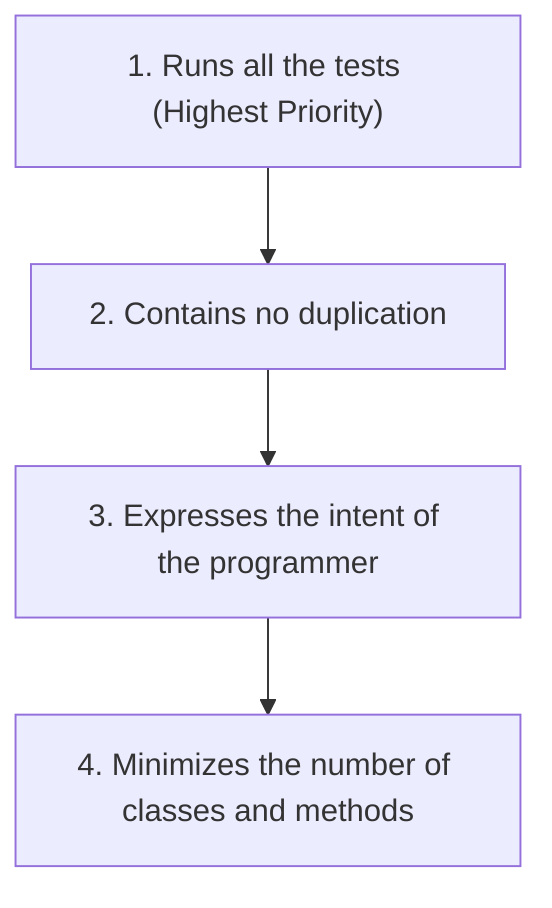

# Chapter 12: Emergence

This chapter explains how to achieve clean architecture through Kent Beck’s four rules of Simple Design.

---

## 🔑 Key Concepts

According to Kent Beck, a design is "simple" if it follows these four rules, in order of priority:

### Rule 1: Runs All the Tests
A system that cannot be verified to perform as expected is not simple.
* Systems that are not testable are not verifiable. If they are not verifiable, they should not be deployed.
* Making code testable pushes us to write small, single-purpose classes that conform to the Single Responsibility Principle and utilize Dependency Injection.

### Rule 2: Refactoring (No Duplication)
Once we have tests, we can safely refactor our code. We should continuously clean our code to eliminate duplication.
* Duplication is the primary enemy of a well-designed system. It represents extra work, extra risk, and extra complexity.
* Eliminate duplication by extracting shared logic into helper methods, parent classes, or helper classes (e.g., Template Method Pattern).

### Rule 3: Expressive Code
The software should be easy to read and understand.
* Most of the cost of software is in its maintenance. Clean names, small functions, and standard design patterns all help make code more expressive.
* The best way to make code expressive is to *care*. Take the time to rename variables, split functions, and refine your logic before moving on.

### Rule 4: Minimal Classes and Methods
While we want small classes and functions, we shouldn't take this to extremes. 
* Do not create hundreds of tiny classes that serve no real purpose.
* Keep class and function counts low, but prioritize Rules 1, 2, and 3 above this one.
