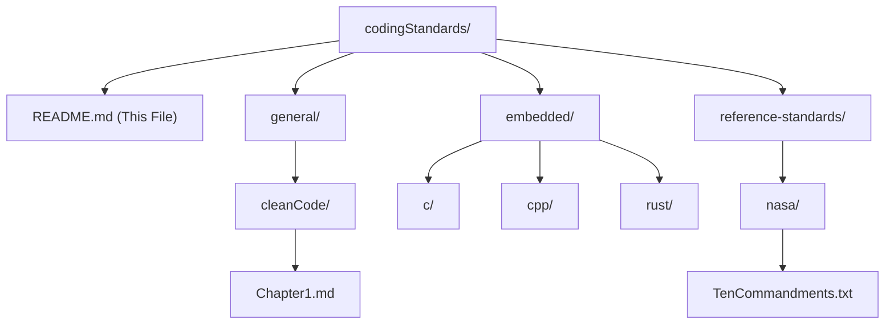

# Coding Standards & Best Practices

Welcome to the **Coding Standards** directory. The ultimate goal of this repository is to define general, high-quality coding standards across a variety of programming languages. 

Initial focus is placed on **Embedded Systems Development** utilizing **C**, **C++**, and **Rust**. Embedded environments impose unique constraints (e.g., real-time deadlines, limited memory, hardware safety boundaries) that require specialized, deterministic coding practices.

---

## 📂 Proposed Directory Structure

To keep standards modular and easily expandable to other domains (e.g., web development, cloud infrastructure) in the future, we organize the standards into **general principles**, **domain-specific standards**, and **industry references**.

### Directory Taxonomy

1. **`general/`**: Platform and language-agnostic standards.
   - **[cleanCode/](file:///home/gboud21/code/Software_Training/doc/codingStandards/general/cleanCode/)**: Summaries and adaptations of classic clean-code methodologies.
     - [Chapter 1: Philosophy](file:///home/gboud21/code/Software_Training/doc/codingStandards/general/cleanCode/Chapter1.md)
     - [Chapter 2: Meaningful Names](file:///home/gboud21/code/Software_Training/doc/codingStandards/general/cleanCode/Chapter2.md)
     - [Chapter 3: Functions](file:///home/gboud21/code/Software_Training/doc/codingStandards/general/cleanCode/Chapter3.md)
     - [Chapter 4: Comments](file:///home/gboud21/code/Software_Training/doc/codingStandards/general/cleanCode/Chapter4.md)
     - [Chapter 5: Formatting](file:///home/gboud21/code/Software_Training/doc/codingStandards/general/cleanCode/Chapter5.md)
     - [Chapter 6: Objects & Data Structures](file:///home/gboud21/code/Software_Training/doc/codingStandards/general/cleanCode/Chapter6.md)
     - [Chapter 7: Error Handling](file:///home/gboud21/code/Software_Training/doc/codingStandards/general/cleanCode/Chapter7.md)
     - [Chapter 8: Boundaries](file:///home/gboud21/code/Software_Training/doc/codingStandards/general/cleanCode/Chapter8.md)
     - [Chapter 9: Unit Tests](file:///home/gboud21/code/Software_Training/doc/codingStandards/general/cleanCode/Chapter9.md)
     - [Chapter 10: Classes](file:///home/gboud21/code/Software_Training/doc/codingStandards/general/cleanCode/Chapter10.md)
     - [Chapter 11: Systems](file:///home/gboud21/code/Software_Training/doc/codingStandards/general/cleanCode/Chapter11.md)
     - [Chapter 12: Emergence](file:///home/gboud21/code/Software_Training/doc/codingStandards/general/cleanCode/Chapter12.md)
     - [Chapter 13: Concurrency](file:///home/gboud21/code/Software_Training/doc/codingStandards/general/cleanCode/Chapter13.md)
     - [Chapters 14–16: Refactoring Case Studies](file:///home/gboud21/code/Software_Training/doc/codingStandards/general/cleanCode/Chapters14_16.md)
     - [Chapter 17: Smells & Heuristics](file:///home/gboud21/code/Software_Training/doc/codingStandards/general/cleanCode/Chapter17.md)
2. **`embedded/`**: Domain-specific standards for embedded systems.
   - **`c/`**: Safe C development, resource constraint management, and hardware safety.
   - **`cpp/`**: Modern C++ best practices for embedded systems (e.g., avoiding RTTI/exceptions, using templates safely).
   - **`rust/`**: Safety-critical systems development using `no_std`, safe concurrency patterns, and the ownership model.
3. **`reference-standards/`**: Curated industry-standard guidelines.
   - **[nasa/](file:///home/gboud21/code/Software_Training/doc/codingStandards/reference-standards/nasa/)**: Safety-critical software standards.
     - *Existing:* [TenCommandments.txt](file:///home/gboud21/code/Software_Training/doc/codingStandards/reference-standards/nasa/TenCommandments.txt) (NASA's Power of 10 rules).

---

## 🛠️ Language Specific Framework (Embedded Systems)

Embedded systems require code to be predictable, testable, and robust. Below is the framework outlining the standards for C, C++, and Rust.

### 1. Embedded C
C remains a cornerstone of embedded development, but its lack of safety features necessitates strict compliance rules.
* **Predictable Execution**: Avoid recursion to ensure stack boundaries are statically analyzable.
* **Deterministic Memory**: Strictly ban dynamic memory allocation (`malloc`, `free`) after the initialization phase to prevent heap fragmentation and memory leaks.
* **References**: See NASA's [TenCommandments.txt](file:///home/gboud21/code/Software_Training/doc/codingStandards/reference-standards/nasa/TenCommandments.txt) for control flow and pointer restrictions.

> [!IMPORTANT]
> All Embedded C code should target compiler flags that treat warnings as errors (e.g., `-Wall -Wextra -Werror`).

### 2. Embedded C++
C++ introduces abstractions that can improve readability but must be used carefully in embedded contexts.
* **Zero-Cost Abstractions**: Leverage template metaprogramming and inline functions to prevent runtime overhead.
* **Restricted Features**: Disable Exceptions (`-fno-exceptions`) and Real-Time Type Information (`-fno-rtti`) to reduce binary size and ensure deterministic execution.
* **Resource Management**: Use RAII (Resource Acquisition Is Initialization) to manage hardware resources (e.g., lock guards, peripheral ownership).

### 3. Embedded Rust
Rust provides compile-time safety guarantees, making it an excellent fit for modern embedded software.
* **Environment**: Target `no_std` environments to run directly on bare metal without a standard library.
* **Memory and Concurrency**: Leverage Rust's ownership model and the `Send` / `Sync` traits to prevent data races and memory corruption at compile time.
* **Unsafe Code Boundaries**: Explicitly document and isolate `unsafe` blocks required for direct register or hardware access, ensuring they are wrapped in safe abstractions.

---

## 🚀 Implementation Roadmap

To build out this directory successfully, we will follow a phased approach:

- [x] **Phase 1: Structure Alignment**: Relocate existing folders (`cleanCode`, `nasa`) to align with the new structure.
- [ ] **Phase 2: Embedded C Guidelines**: Author detailed guidelines for C, focusing on hardware register access and MISRA-C alignment.
- [ ] **Phase 3: Embedded C++ Guidelines**: Establish rules for safe object-oriented design and memory management in C++.
- [ ] **Phase 4: Embedded Rust Guidelines**: Create templates for `no_std` drivers and peripheral access crates.
- [ ] **Phase 5: Automation**: Integrate static analysis tool rulesets (e.g., `.clang-tidy`, `clippy.toml`, `.rustfmt.toml`) into each language directory.
