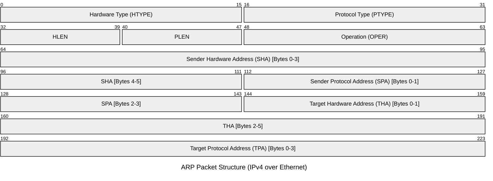

# An Ethernet Address Resolution Protocol (ARP)
- Allows dynamic distribution of the information neeeded to build tables to translate an address implemented by a protocol into a 48-bit Ethernet Address
    - aka convert Protocol Address (IP Address) to a Local Network Address (Ethernet Address)
## Use Case
- host S and target T are on the same network
- S implements protocol P
- S wants to send to T
- Need to find the 48-bit Ethernet Address to transmit

## Packet Format

|Field Name             |Abbrev                     |Size   |Description                |Typical Value
|-|-|-|-|-|
|Hardware Type          |HTYPE                      |2 bytes|Network link protocol type |1 (Ethernet)
|Protocol Type          |PTYPE                      |2 bytes|Internetwork protocol      |0x0800 (IPv4)
|Hardware Length        |HLEN                       |1 byte |MAC address length in bytes|6
|Protocol Length        |PLEN                       |1 byte |IP address length in bytes |4
|Operation|OPER|2 bytes |Request (1) or Reply (2)   |1 or 2
|Sender Hardware Address|SHA                        |6 bytes|MAC address of the sender  |Sender MAC
|Sender Protocol Address|SPA                        |4 bytes|IP address of the sender   |Sender IP
|Target Hardware Address|THA                        |6 bytes|MAC address of the receiver|Target MAC
|Target Protocol Address|TPA                        |4 bytes|IP address of the receiver |Target IP

## Processing
### Packet Generation
- Packet is routed over network
- Consult Address Resolution Module to convert  the <protocol type, target protocol address> pair to a 48-bit Ethernet Address
    - Address Resolution Module tries to find this in the table
        - Gives ethernet address back to the hardware driver
- Hardware driver transmits the packet
- Set the fields of the ARP Request
- Broadcast packet to all workstations on the network

### Packet Reception
- Packet is given to Address Resolution module by the receiving ethernet module
- Runs processing algorithm
    - Do I have the hardware type (optionally check the hardware length)
    - Do I speak the protocol (optionally check the protocol length)
      Yes:
    [optionally check the protocol length ar$pln]
    Merge_flag := false
    If the pair <protocol type, sender protocol address> is
        already in my translation table, update the sender
        hardware address field of the entry with the new
        information in the packet and set Merge_flag to true. 
    ?Am I the target protocol address?
    Yes:
      If Merge_flag is false, add the triplet <protocol type,
          sender protocol address, sender hardware address> to
          the translation table.
      ?Is the opcode ares_op$REQUEST?  (NOW look at the opcode!!)
      Yes:
        Swap hardware and protocol fields, putting the local
            hardware and protocol addresses in the sender fields.
        Set the ar$op field to ares_op$REPLY
        Send the packet to the (new) target hardware address on
            the same hardware on which the request was received.

Notice that the <protocol type, sender protocol address, sender
hardware address> triplet is merged into the table before the
opcode is looked at.  This is on the assumption that communcation
is bidirectional; if A has some reason to talk to B, then B will
probably have some reason to talk to A.  Notice also that if an
entry already exists for the <protocol type, sender protocol
address> pair, then the new hardware address supersedes the old
one.  Related Issues gives some motivation for this.

Generalization:  The ar$hrd and ar$hln fields allow this protocol
and packet format to be used for non-10Mbit Ethernets.  For the
10Mbit Ethernet <ar$hrd, ar$hln> takes on the value <1, 6>.  For
other hardware networks, the ar$pro field may no longer
correspond to the Ethernet type field, but it should be
associated with the protocol whose address resolution is being
sought.